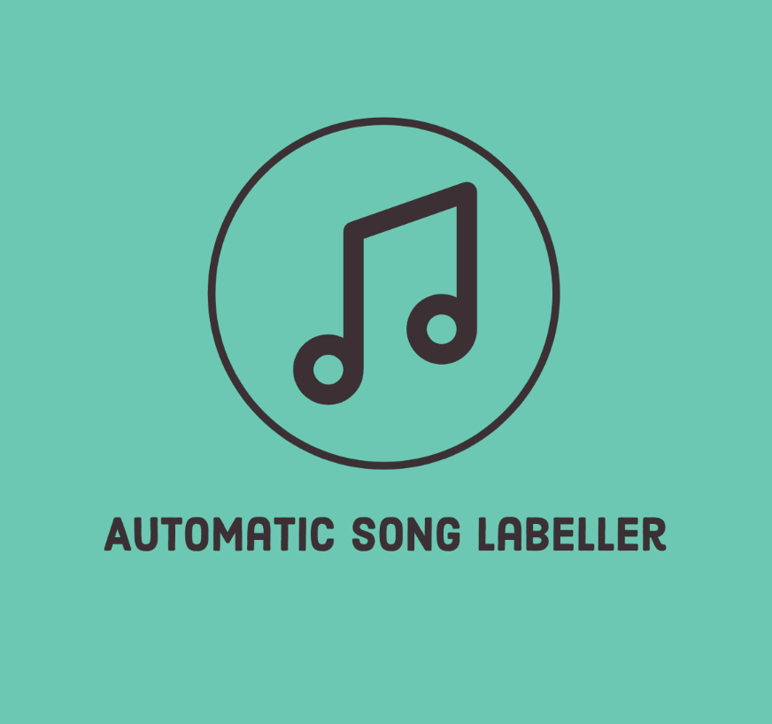

<div id="top"></div>
<!--
*** Thanks for checking out the Best-README-Template. If you have a suggestion
*** that would make this better, please fork the repo and create a pull request
*** or simply open an issue with the tag "enhancement".
*** Don't forget to give the project a star!
*** Thanks again! Now go create something AMAZING! :D
-->


<!-- PROJECT SHIELDS -->
<!--
*** I'm using markdown "reference style" links for readability.
*** Reference links are enclosed in brackets [ ] instead of parentheses ( ).
*** See the bottom of this document for the declaration of the reference variables
*** for contributors-url, forks-url, etc. This is an optional, concise syntax you may use.
*** https://www.markdownguide.org/basic-syntax/#reference-style-links
-->
[![Contributors][contributors-shield]][contributors-url]
[![Forks][forks-shield]][forks-url]
[![Stargazers][stars-shield]][stars-url]
[![Issues][issues-shield]][issues-url]
[![MIT License][license-shield]][license-url]
[![LinkedIn][linkedin-shield]][linkedin-url]


<!-- PROJECT LOGO -->
<br />
<div align="center">
  <a href="https://github.com/othneildrew/Best-README-Template">
    
  </a>

  <h3 align="center">Auto-Song-Labeller</h3>

  <p align="center">
    For all your song labelling needs*
    <br />
    <a href="https://github.com/ppmorgoun/Auto-Song-Labeller/blob/main/README.md"><strong>Explore the docs »</strong></a>
    <br />
    <br />
    <a href="https://github.com/ppmorgoun/Auto-Song-Labeller/issues">Report Bug</a>
    ·
    <a href="https://github.com/ppmorgoun/Auto-Song-Labeller/issues">Request Feature</a>
  </p>
</div>


<!-- TABLE OF CONTENTS -->
<details>
  <summary>Table of Contents</summary>
  <ol>
    <li>
      <a href="#about-the-project">About The Project</a>
      <ul>
        <li><a href="#built-with">Built With</a></li>
      </ul>
    </li>
    <li>
      <a href="#getting-started">Getting Started</a>
      <ul>
        <li><a href="#prerequisites">Prerequisites</a></li>
        <li><a href="#installation">Installation</a></li>
      </ul>
    </li>
    <li><a href="#usage">Usage</a></li>
    <li><a href="#roadmap">Roadmap</a></li>
    <li><a href="#contributing">Contributing</a></li>
    <li><a href="#license">License</a></li>
    <li><a href="#contact">Contact</a></li>
    <li><a href="#acknowledgments">Acknowledgments</a></li>
  </ol>
</details>


<!-- ABOUT THE PROJECT -->
## About The Project

[![Product Name Screen Shot][product-screenshot]](https://github.com/ppmorgoun/Auto-Song-Labeller)

Do you have a large swathe of songs you downloaded via dubiously legal youtube-to-mp3 websites with song titles such as:

Breaking the Habit - Lincoln Park [OFFICIAL MUSIC VIDEO] 

or:

(AUDIO ONLY) Red Hot Chili Peppers - Californication

Then welcome – this app is for you!

**Auto-Song-Labeller** uses state of the art Natural Language Processing techniques to identify which part of your music filename is the song title, which part is the artist name, and automatically labels the song file metadata with these fields.

Here's how I did it:
* I used a subset of the [Million Song Dataset](http://millionsongdataset.com/) to build a custom dataset for Named Entity Recognition 
* I fine-tuned Spacy's large english model on this custom dataset, teaching the model to identify song titles and artist names from text, achieving >90% accuracy on my test dataset
* Using Mutagen to directly edit audio metadata, I walk through your directory and directly edit the metadata tags with the song name and artist

<p align="right">(<a href="#top">back to top</a>)</p>


### Built With


* [Spacy](https://spacy.io/models/en#en_core_web_lg)
* [Mutagen](https://mutagen.readthedocs.io/en/latest/)
* [Pandas](https://pandas.pydata.org/)
* [Numpy](https://numpy.org/)
* [Million Song Dataset](http://millionsongdataset.com/)

<p align="right">(<a href="#top">back to top</a>)</p>


<!-- GETTING STARTED -->
## Getting Started

To get a local copy up and running follow these simple example steps.

### Prerequistes

1. Your music that you wish to label _must_ have both the song name and title in the filename for the NER algorithm to work

### Installation

1. Clone the repo and navigate into it's root directory
   ```sh
   git clone https://github.com/ppmorgoun/Auto-Song-Labeller.git
   ```
2. Create a virtual environment and activate it
    ```sh
   python -m venv path/to/new/envname
   source envname/bin/activate
   ```
3. Install the requirements
   ```sh
   pip install requirements.txt
   ```
4. Navigate into /app and run main_ner_labeller.py
   ```sh
   cd app
   python main_ner_labeller.py
   ```
5. Select your music directory in the popup window that shows, and voila! Your music has now been automatically labelled

<p align="right">(<a href="#top">back to top</a>)</p>


<!-- USAGE EXAMPLES -->
## Usage

Use this program for music that has both the song title and artist name in the file name.


<p align="right">(<a href="#top">back to top</a>)</p>


<!-- ROADMAP -->
## Roadmap

- [x] Add comprehensive Readme
- [ ] Add descriptive comments and lint code
- [ ] Update 1-create-ner-csv.py to create temporary unzipped dataset object
- [ ] Move data to an Amazon S3 bucket
- [ ] Move all training to AWS and utlize entire MillionSongDataset for training

<p align="right">(<a href="#top">back to top</a>)</p>


<!-- CONTRIBUTING -->
## Contributing

Contributions are what make the open source community such an amazing place to learn, inspire, and create. Any contributions you make are **greatly appreciated**.

If you have a suggestion that would make this better, please fork the repo and create a pull request. You can also simply open an issue with the tag "enhancement".
Don't forget to give the project a star! Thanks again!

1. Fork the Project
2. Create your Feature Branch (`git checkout -b feature/AmazingFeature`)
3. Commit your Changes (`git commit -m 'Add some AmazingFeature'`)
4. Push to the Branch (`git push origin feature/AmazingFeature`)
5. Open a Pull Request

<p align="right">(<a href="#top">back to top</a>)</p>


<!-- LICENSE -->
## License

Distributed under the MIT License. See `LICENSE.txt` for more information.

<p align="right">(<a href="#top">back to top</a>)</p>


<!-- CONTACT -->
## Contact

Petr Morgoun - ppmorgoun@gmail.com

Project Link: [https://github.com/ppmorgoun/Auto-Song-Labeller](https://github.com/ppmorgoun/Auto-Song-Labeller)

<p align="right">(<a href="#top">back to top</a>)</p>


<!-- ACKNOWLEDGMENTS -->
## Acknowledgments

Resources I found invaluable and would like to give credit to!

* [This spacy NER medium blog post by Kaustumbh Jaiswal](https://towardsdatascience.com/custom-named-entity-recognition-using-spacy-7140ebbb3718)
* [This song metadata editting blog by Method Matters](https://methodmatters.github.io/editing-id3-tags-mp3-meta-data-in-python/)

<p align="right">(<a href="#top">back to top</a>)</p>


<!-- MARKDOWN LINKS & IMAGES -->
<!-- https://www.markdownguide.org/basic-syntax/#reference-style-links -->
[contributors-shield]: https://img.shields.io/github/contributors/othneildrew/Best-README-Template.svg?style=for-the-badge
[contributors-url]: https://github.com/ppmorgoun/Auto-Song-Labeller/graphs/contributors
[forks-shield]: https://img.shields.io/github/forks/othneildrew/Best-README-Template.svg?style=for-the-badge
[forks-url]: https://github.com/ppmorgoun/Auto-Song-Labeller/network/members
[stars-shield]: https://img.shields.io/github/stars/othneildrew/Best-README-Template.svg?style=for-the-badge
[stars-url]: https://github.com/ppmorgoun/Auto-Song-Labeller/stargazers
[issues-shield]: https://img.shields.io/github/issues/othneildrew/Best-README-Template.svg?style=for-the-badge
[issues-url]: https://github.com/ppmorgoun/Auto-Song-Labeller/issues
[license-shield]: https://img.shields.io/github/license/othneildrew/Best-README-Template.svg?style=for-the-badge
[license-url]: https://github.com/ppmorgoun/Auto-Song-Labeller/blob/master/LICENSE.txt
[linkedin-shield]: https://img.shields.io/badge/-LinkedIn-black.svg?style=for-the-badge&logo=linkedin&colorB=555
[linkedin-url]: https://www.linkedin.com/in/petr-morgoun-537101208/
[product-screenshot]: images/example.png